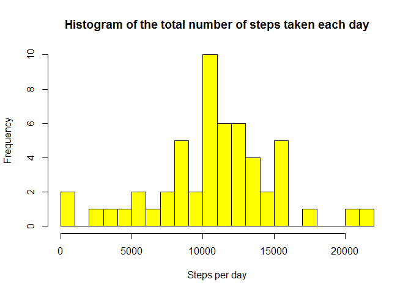
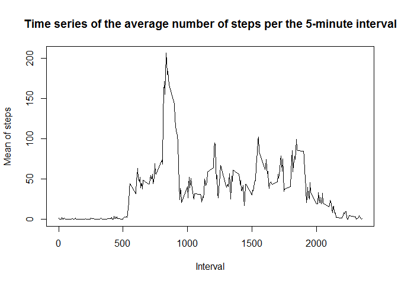
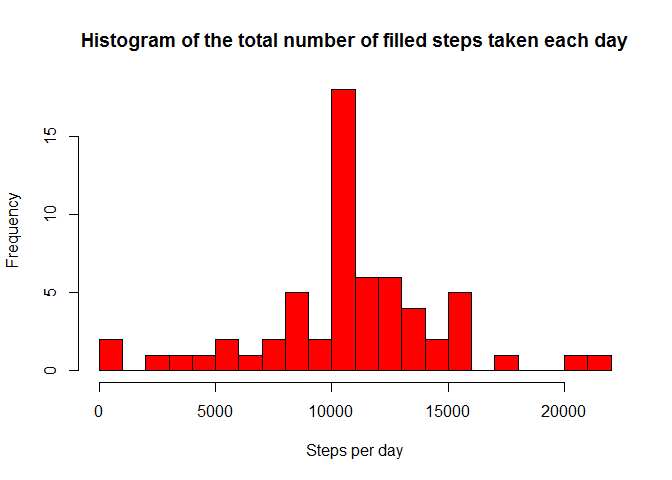
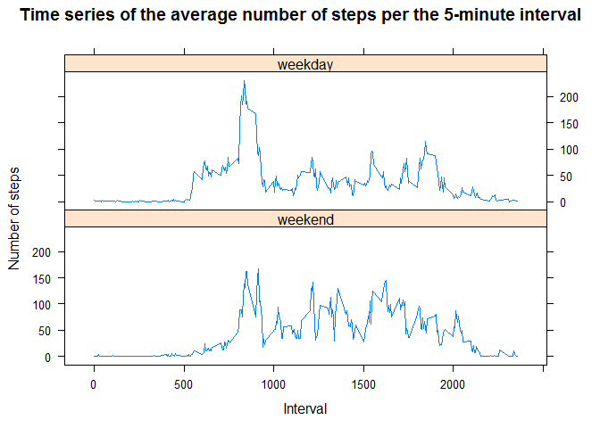

# Reproducible Research: Peer Assessment 1


## Loading and preprocessing the data

We check if raw data exists in the working directory. If it needs we download and extrach data from archive. Then we load raw data into the R.


```r
dataFileName <- "activity.csv"
if (!file.exists(dataFileName)) {
  zipFileName <- "activity.zip"
  if (!file.exists(zipFileName)) {
    dataUrl <- "https://d396qusza40orc.cloudfront.net/repdata%2Fdata%2Factivity.zip"
    download.file(dataUrl, zipFileName, mode="wb")
  }
  unzip(zipFileName)
}
data <- read.csv(dataFileName, colClasses = c("numeric", "Date", "numeric"))
```


## What is mean total number of steps taken per day?

We make a histogram of the total number of steps taken each day:


```r
library(plyr)
dataByDay <- ddply(data, .(date), summarise, sumSteps = sum(steps, na.rm=TRUE), meanSteps = mean(steps, na.rm=TRUE))
hist(dataByDay$sumSteps, breaks=20, col="yellow", main="Histogram of the total number of steps taken each day", xlab="Steps per day")
```

 

```r
#library(ggplot2)
#qplot(sumSteps, data=dataByDay, geom="histogram", main="Histogram of the total number of steps taken each day", xlab = "Steps per day")
```

For total number of steps taken per day we have the following **mean**=9354.23 and **median**=10395. Calculation expressions:


```r
round(mean(dataByDay$sumSteps, na.rm=TRUE), digits=2)
as.character( round(median(dataByDay$sumSteps, na.rm=TRUE), digits=2) )
```


## What is the average daily activity pattern?

We make a time series plot of the 5-minute interval (x-axis) and the average number of steps taken, averaged across all days (y-axis):


```r
dataByInterval <- ddply(data, .(interval), summarise, meanSteps = mean(steps, na.rm=TRUE))
plot(dataByInterval$interval, dataByInterval$meanSteps, type="l", main="Time series of the average number of steps per the 5-minute interval", xlab="Interval", ylab="Mean of steps")
```

 

The 5-minute interval **835**, on average across all the days in the dataset, contains the maximum number of steps. Calculation expression:


```r
dataByInterval[dataByInterval$meanSteps == max(dataByInterval$meanSteps),]$interval
```


## Imputing missing values

We calculate the total number of missing values in the dataset (i.e. the total number of rows with NAs)


```r
# Missing row count
missingRowCount <- nrow(data) - nrow(data[complete.cases(data),]); missingRowCount
```

```
## [1] 2304
```

```r
# Missing steps count
missingStepsCount <- sum(is.na(data$steps)); missingStepsCount
```

```
## [1] 2304
```

Then we devise a strategy for filling in all of the missing values in the dataset. We use the mean for that day, and the mean for that 5-minute interval. After that we create a new dataset that is equal to the original dataset but with the missing data filled in.


```r
suppressMessages(library(dplyr))
dataWithMeans <- data %>%
  mutate(id = 1:nrow(data)) %>%
  merge(select(dataByDay,-sumSteps), by = "date", all.x = TRUE) %>%
  rename(meanStepsByDay = meanSteps) %>%
  merge(dataByInterval, by = "interval", all.x = TRUE) %>%
  rename(meanStepsByInterval = meanSteps) %>%
  arrange(id)
selectNonNa <- function(x) { if (is.na(x[1])) { if (is.na(x[2])) x[3] else x[2] } else x[1] }
stepsFilled <- apply(select(dataWithMeans, steps, meanStepsByDay, meanStepsByInterval), 1, selectNonNa)
dataFilled <- data.frame(data, stepsFilled)
head(dataFilled)
```

```
##   steps       date interval stepsFilled
## 1    NA 2012-10-01        0   1.7169811
## 2    NA 2012-10-01        5   0.3396226
## 3    NA 2012-10-01       10   0.1320755
## 4    NA 2012-10-01       15   0.1509434
## 5    NA 2012-10-01       20   0.0754717
## 6    NA 2012-10-01       25   2.0943396
```

We make a histogram of the total number of filled steps taken each day:


```r
dataFilledByDay <- ddply(dataFilled, .(date), summarise, sumSteps = sum(stepsFilled))
hist(dataFilledByDay$sumSteps, breaks=20, col="red", main="Histogram of the total number of filled steps taken each day", xlab="Steps per day")
```

 

```r
meanFilledStepsTotal = round(mean(dataByDay$sumSteps, na.rm=TRUE), digits=2)
medianFilledStepsTotal = as.character( round(median(dataByDay$sumSteps, na.rm=TRUE), digits=2) )
```

For total number of filled steps taken per day we have the following **mean**=9354.23 and **median**=10395.

As we see, existance of NA values in steps variable leads to big frequency at zero value in histogram.


## Are there differences in activity patterns between weekdays and weekends?

We create a new factor variable indicating whether a given date is a weekday or weekend day.


```r
#install.packages("timeDate")
library(timeDate)
dataFilledWeekdays <- dataFilled %>% mutate(weekday = isWeekday(date))
dataFilledWeekdays$weekday = factor(dataFilledWeekdays$weekday, labels=c("weekend", "weekday"))
```

Then we make a panel plot containing a time series plot of the 5-minute interval (x-axis) and the average number of steps taken, averaged across all weekday days or weekend days (y-axis).


```r
dataFWByInterval <- ddply(dataFilledWeekdays, .(interval, weekday), summarise, meanSteps = mean(stepsFilled))

#datWeekday <- dataFWByInterval[as.character(dataFWByInterval$weekday) == "weekday",]
#datWeekend <- subset(dataFWByInterval, dataFWByInterval$weekday == "weekend")
#par(mfrow=c(2,1))
#plot(datWeekend$interval, datWeekend$meanSteps, type="l", main="Weekend", xlab="Interval", ylab="Number of steps")
#plot(datWeekday$interval, datWeekday$meanSteps, type="l", main="Weekday", xlab="Interval", ylab="Number of steps")

library(lattice)
xyplot(meanSteps ~ interval | weekday, data = dataFWByInterval, layout = c(1,2), type="l", xlab="Interval", ylab="Number of steps", main="Time series of the average number of steps per the 5-minute interval")
```

 

 
